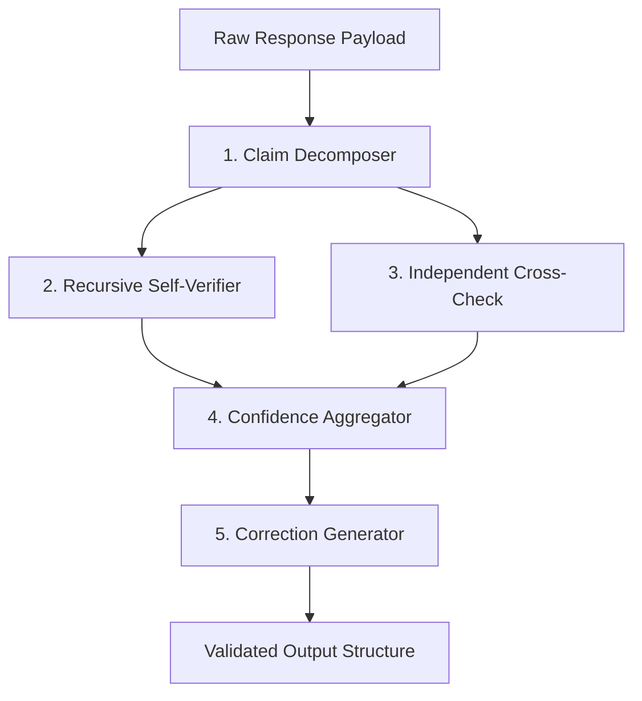

<div align="center">
  <h1>Varity</h1>
  <p><em>Recursive Self-Checking for LLM Hallucination Reduction</em></p>
  
  [](https://pypi.org/project/varity/)
  [](https://pypi.org/project/varity/)
  [](https://opensource.org/licenses/MIT)
  [](#)
  [](#)
</div>

---

## Overview

**Varity** is a lightweight, zero-dependency Python library designed to natively mitigate Large Language Model (LLM) hallucinations. It operates by systematically decomposing generated responses into atomic claims, recursively verifying each claim across iterative context depths, and computing a **Verdict Stability Score (VSS)**.

Unlike traditional single-pass evaluation frameworks, Varity asserts that hallucinatory or uncertain generations are mathematically unstable. By challenging the LLM to verify its own sub-claims recursively, unstable claims will "flip" their verdicts under analytical pressure. Varity measures these algorithmic flips to calculate rigorous confidence bounds.

### Key Capabilities

- **Recursive Verification (Depth N):** Stresses the model to re-evaluate claims repeatedly to track verdict stability.
- **Verdict Stability Score (VSS):** A mathematical metric bounding the resilience of an LLM generation against self-contradiction.
- **Provider Agnostic (BYOK):** Supports Anthropic, OpenAI, and Google Gemini via raw HTTP integrations, ensuring zero telemetry and guaranteeing Bring-Your-Own-Key data sovereignty.
- **Graceful Degradation:** Safely handles upstream provider rate limits (`HTTP 429`) and degradation faults without interrupting the execution pipeline.

## Installation

Varity requires **Python 3.9** or higher.

```bash
pip install varity
```

## Quick Start Configuration

Varity relies on environment variables for provider authentication. This design prevents proprietary API keys from being inherently hard-coded or logged.

```bash
# Export the active provider configuration (gemini, anthropic, openai)
export VARITY_PROVIDER="gemini"

# Export the corresponding provisioning key
export VARITY_API_KEY="your-api-key-here"
```

*(Note: For localized orchestration, standard `.env` root configurations are detected and parsed natively).*

## Usage

### Python API Integration

Varity exposes a strictly-typed, asynchronous API pattern built for production integrations.

```python
import asyncio
import os
from varity import Varity, VarityConfig
from varity.providers import get_provider

async def evaluate_llm_response(response_text: str):
    # 1. Initialize the Target Provider
    provider = get_provider(
        provider_name=os.environ.get("VARITY_PROVIDER", "gemini"),
        api_key=os.environ.get("VARITY_API_KEY")
    )
    
    # 2. Configure Varity Verification Matrix
    config = VarityConfig(
        depth=1,                     # Recursive check layers 
        confidence_threshold=0.6     # Numeric baseline for flagging hallucination
    )
    
    varity = Varity(provider=provider, config=config)
    
    # 3. Execute Evaluation Pipeline 
    result = await varity.acheck(response_text)
    
    print(f"Calculated Confidence: {result.overall_confidence:.2f}")
    print(f"Verdict Stability Score: {result.vss_score:.2f}")
    
    for flagged_claim in result.flagged_claims:
        print(f"Trace Flagged: {flagged_claim.text} -> Reason: {flagged_claim.verdict}")
        
    await provider.close()

if __name__ == "__main__":
    asyncio.run(evaluate_llm_response("Your generated text payload..."))
```

### Command Line Interface

For CI/CD triggers and rapid evaluation benchmarking, Varity ships a comprehensive CLI accommodating both single-text evaluations and batch processing.

```bash
# Evaluate a solitary string context directly
varity check "Einstein won the Nobel Prize for Relativity in 1921." --provider anthropic

# Process bulk evaluations asynchronously via JSONL structure
varity batch ingest_dataset.jsonl output_results.jsonl --provider openai
```

### CI/CD Integration

Varity is designed to be easily integrated into CI/CD pipelines to enforce hallucination checks on generated outputs before deployment.

#### Example: GitHub Actions

Create a `.github/workflows/varity-check.yml` file:

```yaml
name: Varity Hallucination Check
on: [push, pull_request]

jobs:
  varity_check:
    runs-on: ubuntu-latest
    steps:
      - uses: actions/checkout@v3
      - name: Set up Python
        uses: actions/setup-python@v4
        with:
          python-version: "3.9"
      - name: Install dependencies
        run: pip install varity
      - name: Run dynamic cycle checks
        env:
          VARITY_PROVIDER: ${{ secrets.VARITY_PROVIDER }}
          VARITY_API_KEY: ${{ secrets.VARITY_API_KEY }}
        run: |
          # Example: Run 5 evaluation cycles on your test script
          python test101.py --cycles 5
```

## Core Architecture

Varity governs a strict 5-stage deterministic evaluation flow:



1. **Claim Decomposition**: Segments cohesive text strings into isolated, atomic `Claim` schema nodes.
2. **Recursive Self-Verification**: Executes isolated iterative passes across isolated claims (Depth 0...N), dynamically tracking historical verdict variance.
3. **Cross-Checking**: Instantiates an identical external process verifying the claim devoid of the initial contextual bias.
4. **Confidence Aggregator**: Maps the volume of boolean "flips" and base metric alignments to construct the total `vss_score`.
5. **Correction Generation**: Automatically rebuilds text omitting nodes scored beneath the rigorous confidence threshold.

## Testing & Contribution

Varity enforces stringent coding standards to ensure algorithmic reliability.

**Merge Requirements:**
- **Testing:** `pytest tests/ -v` (Must achieve high branch coverage)
- **Linting/Formatting:** `ruff check .`
- **Type Inspection:** `mypy --strict .`

Please reference `CONTRIBUTING.md` prior to submitting structural architectural proposals.

## License

Varity is distributed under the terms of the MIT License.
